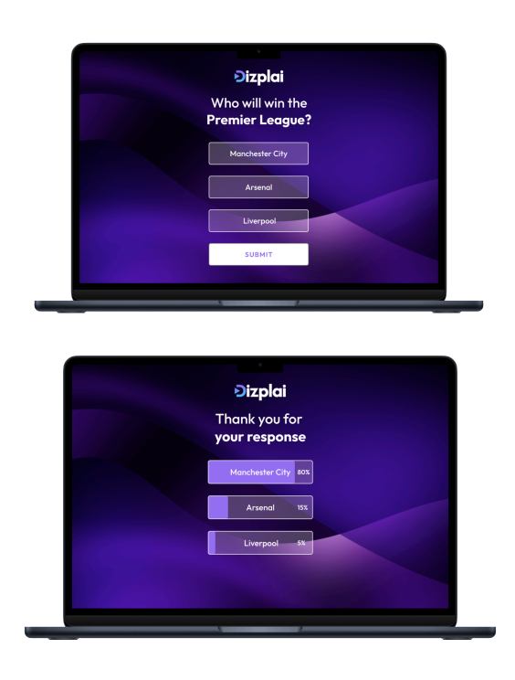

# Dizplai Coding Challenge

We would like you to build a system to allow users to vote on polls to work alongside our
graphics platform. A user should visit a website and be shown the currently active poll, they
should be able to select one of the options to cast a vote and then be shown the vote
percentage of each option.
The objective of this exercise is to allow us to see how you write and structure your code, try
to write it as you would for a production system and if any assumptions are made add them
to the README.
We suggest using React / Vue and Java / Node however use the language or framework you
are most comfortable with.
We have provided example designs at the bottom of the document.

## Requirements

- Polls can have between 2 and 7 options
- The website should be responsive
- Polls and votes should be stored in a database of some sort
- New polls should be created through an API
- An API should be available to view individual votes for a given poll and the time the
  vote was made
- There should be an example of how you would test front and backend code. There is
  no need to test the entire code base
- A README should be provided explaining how to run any code to allow us to test the
  solution

## Submission

Please either send your complete solution in a ZIP folder or upload to a Git repository.
If you have had any issues or have been unable to complete the project, please put details in
the README.

## Example Designs

